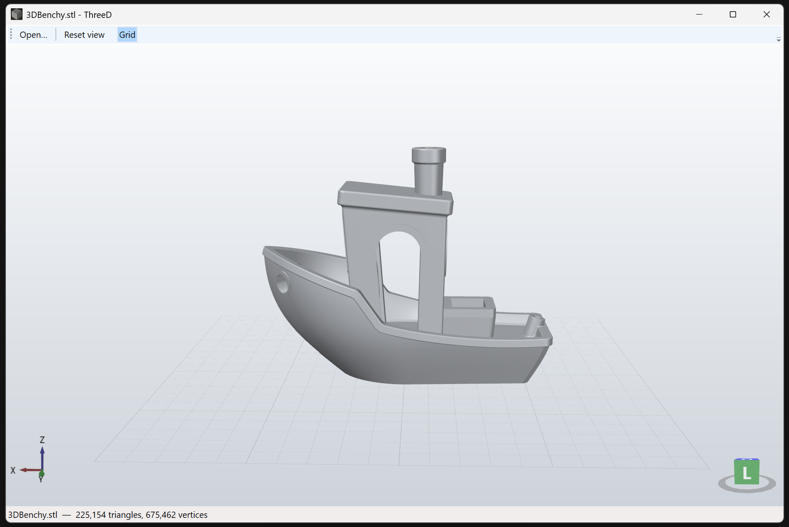

# ThreeD

A small standalone Windows viewer for 3D-printing model files. WPF (.NET 10) + Helix Toolkit.



## Supported formats

- **3MF** — custom importer: core spec, build transforms, components, base-material colors,
  and the production extension's `p:path` part references (used by Bambu Studio / Orca project files)
- **glTF / GLB** — via SharpGLTF (base-color materials, scene graph, Y-up converted to Z-up)
- **STL, OBJ, PLY, OFF, 3DS, LWO** — via Helix Toolkit's built-in readers

## Usage

- `Open…` (Ctrl+O), drag-and-drop a file onto the window, or `ThreeD.exe <file>`
- Left-drag: rotate · Wheel: zoom · Right-drag: pan · `Reset view` reframes the model

### Headless snapshot mode

Renders a model to PNG without showing a window (handy for scripts/thumbnails):

```
ThreeD.exe --snapshot <model> <output.png> [width height]
```

## Build

```
dotnet build ThreeD.csproj
```

Standalone single-file exe:

```
dotnet publish ThreeD.csproj -c Release -r win-x64 --self-contained -p:PublishSingleFile=true
```

Output lands in `bin\Release\net10.0-windows\win-x64\publish\`.

## Samples

`samples\` contains tiny test files: `cube.stl`, `cube.3mf` (two cubes exercising
components, transforms, and material colors), `triangle.gltf`.
